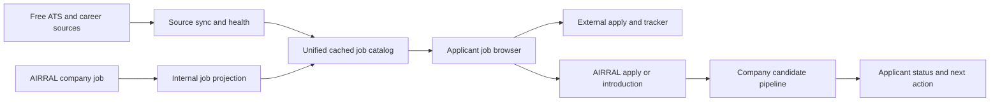

# AIRRAL Product Completion Agent Plan

Date: 2026-08-14

Status: execution plan based on a code, database, route, product-contract, and build audit.

## Product Definition

AIRRAL has two customers:

- **Applicant:** the person looking for work. The applicant is the owner of their profile, resume, preferences, evidence, applications, and introduction consent.
- **Company:** an organization and its authorized hiring team. A company creates jobs, reviews consented applicants, manages interviews and offers, and closes the loop with candidates.

AIRRAL has two job-supply lanes, and both must remain supported:

1. **Source jobs:** jobs fetched from free, official, or permitted public ATS/career sources. These provide useful coverage while AIRRAL recruits companies and continue to provide discovery breadth later.
2. **AIRRAL company jobs:** jobs created by companies inside AIRRAL. These provide the higher-trust path because AIRRAL can own the application, response timeline, candidate status, interviews, and offer workflow.

External jobs are not temporary throwaway data. They are the supply floor. AIRRAL company jobs are the managed layer that should become more valuable over time.

## Completion Standard

The first complete product must support this loop:

1. An applicant creates an account and reviews a parsed resume profile.
2. AIRRAL shows active source jobs and AIRRAL company jobs in one job browser.
3. The applicant can tell which job type they are viewing and what AIRRAL can guarantee.
4. The applicant sees job quality, requirements fit, salary/work mode, source freshness, and work-authorization evidence.
5. The applicant saves, improves, externally applies, or applies/requests an introduction through AIRRAL.
6. A company creates a transparent job and sees consented applicants or introduction requests.
7. The company reviews evidence, advances or declines the applicant, and records the next step.
8. The applicant sees the status, reminder, and outcome in the tracker.
9. Closing a company job removes it immediately from discovery and notifies active candidates.
10. Disappeared source jobs are deactivated after a successful complete source sync and remain recognizable in saved history.

The product is not complete if jobs can be browsed but the applicant and company workflows remain disconnected.

## Audit Summary

### Working foundation

- Applicant routes are focused on `Jobs`, `Tracker`, and `Profile`.
- Applicant onboarding, profile preferences, resume upload, parsing, health scoring, fit analysis, saved jobs, and notification preferences exist.
- The database currently has thousands of active cached jobs and more than one hundred active free sources.
- Source connectors exist for Greenhouse, Lever, Ashby, SmartRecruiters, Workable, Workday, BambooHR, and career-page families.
- Company registration creates an organization and an `HR_MANAGER` user.
- Company jobs, applications, interviews, offers, referrals, analytics, and role-scoped access exist.
- Organization-scoped job and application repository queries are present.
- Backend tests pass.
- Applicant and company production builds pass when run serially.

### Product and architecture gaps

1. Applicant discovery and saved-job fit use `external_job_postings`; company jobs and applications use `jobs` and `applications`.
2. `AIRRAL_INTERNAL` is recognized as a source label, but company jobs are not projected into applicant discovery.
3. Candidate saved jobs and fit results only resolve active external postings.
4. Saved source jobs lose useful title/company detail after the source posting becomes inactive.
5. A successful source sync upserts current jobs but does not deactivate postings missing from that completed snapshot.
6. The company ATS score checks configured keywords against the cover letter, hides applicants below a threshold, and sorts by that score.
7. Applicant identity, resume ownership, and `applicantId` are accepted from the application request instead of being derived entirely from the authenticated applicant.
8. The applicant tracker has backend update support, but the current template does not expose a complete status, notes, date, and follow-up workflow.
9. The company portal has overlapping `Home`, `Dashboard`, `Hire Tool`, and `Candidates` experiences.
10. Several company settings, notes, scorecards, stages, and integrations display UI but are TODOs, alerts, or mock state.
11. The public website shows only AIRRAL `jobs` records while the applicant portal shows the source catalog, creating two different job experiences.
12. There are no frontend tests.
13. `CandidateJobSearchService` and `ExternalJobPostingStore` have become large multi-purpose classes that make parallel changes risky.

## Keep, Park, Consolidate, Delete

No agent should delete a surface merely because it is not launch-critical. Use this list.

### Keep and complete now

Applicant:

- Login and registration.
- Onboarding and job preferences.
- Jobs list/detail.
- Resume upload, parse review, health, and role fit.
- Saved jobs and tracker.
- Notification preferences and follow-up reminders.

Company:

- Employer registration and organization tenancy.
- Job creation, publishing, editing, closing, and filling.
- Applicant review and pipeline.
- Candidate notes and activity history.
- Interviews, scorecards, and offers.
- Essential organization and hiring settings.

Shared platform:

- External source registry and scheduled ingestion.
- Active cached source postings.
- Public cached-only job detail guardrail.
- Source health/admin visibility.
- Authentication, authorization, and organization isolation.

### Delete after reference and build checks

- `apps/applicant-portal/src/app/pages/candidate-dashboard/` in full. It is unreachable from current routes and its code only references files inside the same legacy tree.
- Candidate dashboard mock data and old social/profile/insight rail components contained in that tree.
- Mock LinkedIn connection controls and promises from the company job form until a real approved integration exists.
- Unreachable placeholder components that remain after the company-surface consolidation.

Deletion acceptance rule:

- Prove there are no imports/routes with `rg`.
- Delete in one isolated commit.
- Build the affected app immediately.
- Do not combine deletion with behavioral changes.

### Park behind disabled feature flags

- Rooms and direct messaging.
- Community/social posting.
- General events.
- Founder spaces.
- Employee benefits and broad HRIS profile features.
- Mock third-party integrations.
- Custom interview-kit and custom hiring-stage editors until persistence is implemented.

Keep useful backend foundations, but disabled features must not appear in launch navigation and should not register public mutation endpoints unless explicitly enabled.

News and company signals may remain only when attached to a job decision. Separate market news reads from community posting permissions.

### Consolidate before deleting duplicates

Company portal:

- Merge useful summary metrics from `Dashboard` into `Home`.
- Merge `Hire Tool` stage workflow and `Candidates` detail/evidence workflow into one `Candidates` or `Pipeline` route.
- Keep `Jobs`, `Candidates/Pipeline`, `Interviews`, `Offers`, and `Settings` as the primary company navigation.
- Keep `Analytics` as a secondary paid/flagged route only after its data is reliable.
- Move employee referrals and employee-only pages out of the company hiring launch path.

Applicant portal:

- Split resume management and resume review from the oversized profile page into a first-class `Resume` route.
- Keep personal details and job preferences in `Profile`.
- Break the large jobs component into filter bar, list, selected detail, fit, and apply-action components without changing the route contract.

Website:

- Remove claims about rooms, SSO, white label, API access, calendar integrations, or other unfinished features.
- Do not publish unvalidated prices as if billing is live.
- Use the same catalog read API as the applicant product for public job discovery, with lighter public responses.

## Unified Job Catalog Design

Do not replace the source-ingestion system. Extend its cached posting model into a job catalog read model.

The least disruptive design is to continue using `external_job_postings` as the current catalog table while adding a projection for AIRRAL company jobs. A later migration may rename this table after behavior is stable.

### Catalog identity

Every discoverable job needs:

- `catalogPostingId`: opaque stable public identifier.
- `sourceJobKey`: stable internal key.
- `sourceType`: `AIRRAL_INTERNAL`, ATS source, career page, or partner source.
- `applyMode`: `INTERNAL_APPLY`, `PARTNER_APPLY`, or `EXTERNAL_APPLY`.
- Optional `organizationId` and `internalJobId` for AIRRAL company jobs.
- Source attribution, first-seen, last-seen, source-updated, and last-verified dates.

Recommended internal key:

```text
AIRRAL_INTERNAL:{organizationId}:{jobId}
```

### Company-job projection

Add a `JobCatalogProjectionService` that:

- Creates or resolves an `external_companies` row linked to the AIRRAL organization.
- Creates an `AIRRAL_INTERNAL` source row using a stable organization board key.
- Upserts an open company job into the catalog immediately after publish/update.
- Caches the complete company-job detail so no source fetch is attempted.
- Sets `INTERNAL_APPLY`, direct source quality, and managed-response signals.
- Deactivates the catalog projection immediately when the job is closed, filled, or deleted.
- Runs a reconciliation job that repairs missed projections.

Do not add `AIRRAL_INTERNAL` to external network client dispatch. Its detail always comes from the cache or internal job projection.

### Source-job ingestion

Keep scheduled fetching from free official sources.

Each connector result must say whether it represents:

- A **complete snapshot** of all current postings for that source.
- A **partial page/window** where absence cannot mean closure.

For a successful complete snapshot:

1. Start a source sync generation.
2. Upsert every seen job with that generation.
3. Deactivate previously active jobs for that source not seen in the generation.
4. Record counts and finish the source transaction.

For a partial or failed sync:

- Never deactivate merely because a job was absent.
- Retain the age/expiry fallback.
- Surface degraded source health to admins.

### Saved-history behavior

Saving a job must preserve a small immutable snapshot:

- Title.
- Company.
- Location/work mode.
- Apply URL at save time.
- Source type.
- Salary label.
- Posting status at last check.

When a source job closes, the tracker should say `No longer active` while retaining the original saved details. It must not degrade to `Saved job / Source unavailable`.

### Ranking behavior

Source jobs and company jobs appear in the same list. Do not artificially hide external jobs as company adoption grows.

AIRRAL company jobs may receive transparent advantages only for facts AIRRAL can verify:

- Active status controlled by AIRRAL.
- Structured requirements and salary.
- Direct application.
- Response commitment.
- Status tracking.

Label these benefits instead of silently boosting an unexplained score.



## Application And Introduction Model

### External source job

- Applicant saves or opens the official external apply URL.
- AIRRAL records `APPLYING` only after user action.
- Applicant confirms `APPLIED`; AIRRAL does not pretend to know an external ATS outcome.
- Tracker, resume version, notes, and follow-up remain available.

### AIRRAL company job

- Applicant selects `Apply with AIRRAL` or `Request introduction`.
- Backend derives user ID, name, email, profile, and owned resume from the authenticated principal.
- Backend verifies that the projected internal job is open.
- Candidate explicitly reviews and consents to the evidence shared with that company.
- Application/introduction is idempotent for applicant plus job.
- Company sees the candidate in its organization-scoped pipeline.
- Status changes create applicant-visible events and notifications.

### Evidence, not an ATS gate

Remove cover-letter keyword scoring as a visibility gate.

Company review should show:

- Required qualification: evidenced, uncertain, or not evidenced.
- Supporting resume line or candidate-confirmed answer.
- Relevant experience range and confidence.
- Work-mode, location, salary, and work-authorization alignment.
- Candidate's reason for interest.
- Resume/document version shared with consent.

Never hide a candidate automatically based on a generated score. Hard constraints must be explicit, job-related, legally appropriate, and reviewable.

## Agent Execution Rules

All agents must:

- Read the workspace and frontend `AGENTS.md` files plus the design contracts before editing.
- Treat existing uncommitted changes as user work and never revert them.
- Work only in assigned ownership areas.
- Add or update tests for changed behavior.
- Run the narrowest build/test first, then the required product gate.
- Report migrations, API changes, and unresolved risks in the handoff.
- Avoid speculative refactors outside the assigned acceptance criteria.

Contract changes are serialized. Feature agents must not independently invent job IDs, statuses, privacy states, or API field names.

## Delivery Waves

### Wave 0: Contract and baseline

Run this wave before parallel feature work.

#### Agent 0A: Product contracts and ADR

Objective:

- Freeze the job catalog, apply mode, application, introduction, privacy, and status contracts.

Owns:

- New architecture decision record under `airral-frontend/docs/`.
- Shared status and API contract documentation.
- Shared DTO/type skeletons only.
- CI verification command documentation.

Must not:

- Redesign UI.
- Refactor connector implementations.
- Delete legacy files.

Acceptance:

- One source of truth exists for `catalogPostingId`, `sourceJobKey`, `applyMode`, application statuses, introduction statuses, and identity release.
- Applicant, company, website, and backend names agree.
- Serial frontend build behavior is documented so Nx/Angular build races do not create false failures.

#### Agent 0B: Database migration and projection foundation

Objective:

- Add internal job projection fields and catalog identity without breaking current source jobs.

Owns:

- Next Flyway migration.
- `JobCatalogProjectionService` and its repository/store.
- Projection reconciliation service/test.
- `JobService` publish/update/close projection calls.

Must not:

- Change applicant UI.
- Rewrite external connector clients.
- Change application scoring.

Acceptance:

- Publishing an internal job creates one active catalog posting.
- Updating it changes the same posting.
- Closing/filling it deactivates the posting immediately.
- Reconciliation repairs a missing or stale projection.
- Existing external source postings remain readable.
- Migration applies and rolls back cleanly in a transactional validation.

### Wave 1: Isolated cleanup

These agents can work in parallel after Wave 0 contracts are accepted.

#### Agent 1A: Applicant dead-code cleanup

Objective:

- Remove the unreachable legacy applicant dashboard and mocks without changing active behavior.

Owns:

- `apps/applicant-portal/src/app/pages/candidate-dashboard/`.
- Applicant-only unused imports/styles discovered after deletion.

Must not:

- Change active jobs, tracker, profile, onboarding, shared API, or backend behavior.

Acceptance:

- No references to removed components remain.
- Applicant production build passes.
- `/jobs`, `/tracker`, `/profile`, `/onboarding`, and `/login` routes remain unchanged.

#### Agent 1B: Company information architecture cleanup

Objective:

- Reduce the company portal to a hiring product without deleting working hiring capabilities.

Owns:

- Company routes, navigation, shell, and workspace home.
- Feature flags for employee-HRIS and mock settings pages.

Must not:

- Change job/application APIs.
- Implement pipeline behavior.
- Delete a duplicate workflow before its useful behavior is assigned to a retained route.

Acceptance:

- Primary navigation is `Home`, `Jobs`, `Candidates`, `Interviews`, `Offers`, `Settings`.
- Analytics is secondary/flagged.
- Benefits, employee profile, team review, referrals, and fake integrations do not appear in launch navigation.
- Company production build passes.

#### Agent 1C: Website truth cleanup

Objective:

- Make public claims match shipped behavior.

Owns:

- Website marketing copy, employer page, pricing display, and header routes.

Must not:

- Change backend billing or auth behavior.
- Add unsupported testimonials, customer counts, or outcome claims.

Acceptance:

- No launch copy promises rooms, SSO, white label, API access, calendar integration, or other unfinished features.
- Employer offer focuses on transparent jobs and qualified, consented candidates.
- Applicant offer focuses on real jobs, fit, and tracking.
- Website browser build succeeds; SSR verification runs in an environment permitted to bind localhost.

### Wave 2: Source and catalog correctness

Run these tasks serially because they touch shared catalog persistence.

#### Agent 2A: Complete-snapshot source lifecycle

Objective:

- Close disappeared jobs safely without damaging partial-source results.

Owns:

- `ExternalJobSyncService`.
- Source sync result metadata.
- External posting write/lifecycle queries.
- Source-sync tests.

Acceptance:

- Missing jobs deactivate only after successful complete snapshots.
- Failed and partial syncs never mass-close jobs.
- Disabled sources deactivate their postings.
- Retention expiry remains a fallback.
- Source health records seen, upserted, closed, failed, and duration counts.

#### Agent 2B: Catalog read contract and service split

Objective:

- Make applicant and website reads independent of external-only assumptions.

Owns:

- Catalog summary/detail query boundary.
- Candidate job controller/read service.
- Public catalog DTO mapping.
- Read-side tests.

Acceptance:

- One page can contain external and `AIRRAL_INTERNAL` jobs.
- Internal detail reads cached/projected data without external network dispatch.
- Public details still require an active discovered posting.
- Server-side filters run before pagination.
- Visa-friendly filters distinguish positive evidence from unknown.
- Existing free sources continue to populate the same feed.

#### Agent 2C: Saved-job snapshots

Objective:

- Preserve candidate history after source closure.

Owns:

- Saved-job snapshot migration/domain/DTO/service.
- Saved-history tests.

Acceptance:

- An inactive saved job retains title, company, source, location, salary, and original URL.
- Tracker visibly marks the job inactive.
- Fit history remains readable.
- New fit runs are blocked or clearly warned for closed jobs.

### Wave 3: Applicant and company core workflows

These agents can work in parallel after Wave 2 API contracts are stable.

#### Agent 3A: Applicant job and resume workspace

Objective:

- Complete the applicant's job decision workflow.

Owns:

- Active applicant `Jobs` UI and child components.
- New applicant `Resume` route.
- Applicant `Profile` responsibility reduction.
- Candidate catalog/shared API client methods after contracts are frozen.

Acceptance:

- External and AIRRAL jobs are clearly labeled without visually fragmenting the feed.
- Internal jobs show `Apply with AIRRAL`; source jobs show `Apply on official site`.
- Selected detail shows source verification, freshness, salary/work mode, requirements, fit, and action.
- Resume parse output can be reviewed and corrected.
- Full fit categories and truthful suggested improvements are visible.
- Desktop and mobile Playwright checks pass.

#### Agent 3B: Applicant tracker completion

Objective:

- Turn saved jobs into an operational job-search memory.

Owns:

- Applicant tracker UI.
- Tracker-specific API calls and component tests.

Acceptance:

- User can change status without deleting/recreating the job.
- User can edit next step, due date, notes, contact, and resume version.
- External applications require user confirmation.
- Internal applications update from company status events.
- Inactive jobs retain history and display a clear closure state.
- Follow-up due state and badge refresh after edits.

#### Agent 3C: Company transparent job creation

Objective:

- Make company-created jobs trustworthy and catalog-ready.

Owns:

- Company job form and jobs page.
- Job request/response fields after contract freeze.
- Job publishing UX.

Acceptance:

- Structured salary, work mode, locations, employment type, must-have, preferred, authorization/sponsorship, hiring timeline, interview stages, and response commitment fields exist.
- Draft jobs are private.
- Published jobs appear in the applicant catalog.
- Closed/filled jobs disappear immediately from discovery.
- Mock LinkedIn controls are removed.

#### Agent 3D: Resume evidence engine

Objective:

- Produce reviewable evidence instead of opaque keyword scores.

Owns:

- Resume parser, skill catalog, fit analyzer, evidence DTO/service, and tests.

Must not:

- Make employer hiring decisions.
- Introduce LLM dependence into the required baseline.

Acceptance:

- Resume parse returns editable sections and confidence/warnings.
- Fit separates required, core, and preferred evidence.
- Each positive skill/experience claim has supporting resume text or candidate confirmation.
- Suggestions never fabricate experience.
- Cross-industry fixtures cover technical and non-technical resumes.

### Wave 4: Connect applicants and companies

#### Agent 4A: Authenticated internal apply and consent

Objective:

- Create the secure application/introduction bridge.

Owns:

- Candidate apply/introduction controller and service.
- Application and introduction migrations/domains/repositories.
- Candidate identity/resume ownership validation.
- Idempotency and status-event tests.

Acceptance:

- Candidate identity is derived from JWT, not request-supplied IDs or emails.
- Resume document must belong to the candidate.
- Job must map to an active internal company job.
- Candidate reviews the evidence snapshot and records per-job consent.
- Duplicate submission is idempotent.
- Application appears only to the correct organization.
- Tracker links to the resulting application/introduction.

#### Agent 4B: Company candidate pipeline consolidation

Objective:

- Replace duplicate company candidate screens with one working pipeline and detail view.

Owns:

- Retained company `Candidates/Pipeline` route.
- Candidate evidence, stage controls, notes, activity, and resume access UI.
- Removal of superseded `Hire Tool` or candidates UI only after parity.

Acceptance:

- No applicant is hidden based on generated score.
- Stage changes persist and notify the applicant.
- Candidate detail shows consented evidence and uncertainty.
- Notes persist with author and timestamp.
- Resume download uses an authorized backend route, not an alert.
- Declines use a simple reason category and create applicant-visible status where appropriate.

#### Agent 4C: Interviews, scorecards, and offers completion

Objective:

- Replace TODO and alert behavior in the retained hiring workflow.

Owns:

- Interview, scorecard, offer UI/API behavior and corresponding backend endpoints.

Acceptance:

- Interview scheduling persists and emits applicant notification/status.
- Scorecard draft and submit persist with permissions.
- Offer create/send/withdraw/acceptance-state behavior is tested.
- Company and applicant see consistent status names and dates.
- No success alert is displayed before server confirmation.

### Wave 5: Reliability, security, and release

#### Agent 5A: Frontend test foundation

Objective:

- Add meaningful automated coverage without blocking feature agents on a large testing rewrite.

Owns:

- Frontend test configuration.
- Shared fixtures and critical component/service tests.
- Playwright smoke tests if the repository chooses Playwright.

Acceptance:

- Applicant login, jobs, save, fit, internal apply, external apply confirmation, and tracker flows have smoke coverage.
- Company signup, publish, candidate review, stage change, close, interview, and offer flows have smoke coverage.
- Tests use stable data fixtures and no arbitrary external network calls.

#### Agent 5B: Security and privacy review

Objective:

- Verify tenant isolation, applicant consent, and upload/apply safety.

Owns:

- Security tests, rate limits, upload authorization, response redaction, and endpoint audit.

Acceptance:

- Cross-organization job/application/candidate access is denied.
- Applicants cannot read another applicant's resume, tracker, or application.
- Company users cannot browse private candidate profiles.
- Public APIs expose no applicant emails or internal IDs.
- Resume files use authenticated signed/streamed access.
- Register, login, resume upload, application, and introduction endpoints have practical rate limits.

#### Agent 5C: Operations and source health

Objective:

- Make the mixed job supply observable and supportable.

Owns:

- Admin source health, sync-run diagnostics, catalog reconciliation diagnostics, and release smoke checks.

Acceptance:

- Admin can see active sources, success/failure time, jobs seen, jobs closed, error, and stale status.
- Alerts exist for zero-result complete snapshots, repeated source failure, projection drift, and broken apply links.
- Release smoke verifies auth, catalog, detail, save, fit, internal publish/apply, source sync, tracker, and company pipeline.

## Shared API Contract Freeze

Before Wave 3, the lead agent must publish example JSON for:

- Job summary.
- Job detail.
- Saved job.
- Resume parse review.
- Fit evidence.
- Internal apply request/response.
- Introduction request/response.
- Company candidate evidence.
- Application status event.

No UI agent should map backend objects with `any` or invent fallback fields such as defaulting all departments to Engineering.

## Test And Build Gates

Per backend agent:

```bash
./gradlew test
./gradlew build
```

Per frontend agent, run the affected project serially:

```bash
env -u FORCE_COLOR CI=true NX_DAEMON=false NX_TUI=false NG_FORCE_TTY=0 yarn nx build applicant-portal --configuration=production --verbose
env -u FORCE_COLOR CI=true NX_DAEMON=false NX_TUI=false NG_FORCE_TTY=0 yarn nx build hr-portal --configuration=production --verbose
env -u FORCE_COLOR CI=true NX_DAEMON=false NX_TUI=false NG_FORCE_TTY=0 yarn nx build website --configuration=production --verbose
```

The current environment showed unreliable failures when Angular application builds ran concurrently. Keep CI builds serial until that race is diagnosed.

Website SSR/prerender must also be verified outside a restricted sandbox because its build attempts to bind localhost during rendering.

Every migration agent must validate migrations against a copy of real schema/data and include row-count/invariant checks.

## Release Milestones

### Milestone 1: Clean single-sided beta

- Legacy applicant dashboard removed.
- Company navigation focused.
- Website claims truthful.
- Source job freshness and closure behavior correct.
- Applicant resume review, save, fit, and tracker complete.

### Milestone 2: AIRRAL company jobs in the catalog

- Company publish/update/close projection works.
- One mixed applicant feed contains source and company jobs.
- Company jobs have structured transparency and direct apply mode.
- Public and authenticated job reads use one catalog contract.

### Milestone 3: Applicant-company connection

- Authenticated internal application/introduction works.
- Consent and evidence snapshot are recorded.
- Company pipeline is consolidated and score gating removed.
- Status updates reach the applicant tracker.

### Milestone 4: Hiring completion

- Notes, interviews, scorecards, declines, offers, and job closure work end to end.
- Security and cross-tenant tests pass.
- Applicant and company smoke tests pass.
- Source health and catalog projection are observable.

## Product-Level Acceptance Scenario

Use this as the final demonstration:

1. Source sync imports a live Greenhouse job.
2. A company signs up and publishes an AIRRAL job.
3. Both jobs appear in the applicant feed with correct source/apply labels.
4. Applicant uploads a resume, corrects one parsed skill, and runs fit on both jobs.
5. Applicant saves the external job, opens the official application, and confirms it as applied.
6. Applicant applies to the AIRRAL company job and consents to the evidence shared.
7. Only that company sees the applicant.
8. Company reviews evidence, adds a note, advances to interview, submits a scorecard, and extends an offer.
9. Applicant tracker receives each status and next action.
10. Company closes the job; it disappears from discovery but remains in both parties' history.
11. The external source later returns a successful complete snapshot without its first job; that job is marked inactive but remains readable in the applicant tracker.

When this scenario passes with automated smoke coverage, AIRRAL has a coherent applicant-and-company product rather than two adjacent portals.
